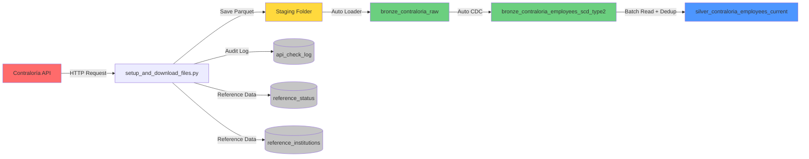

# 🏛️ Public Payroll Pipeline - Office of the Comptroller General of Panama

[](https://www.linkedin.com/in/jquesada92/)
[](https://databricks.com)
[](https://www.python.org/)

## 📋 Overview

Enterprise data pipeline for extracting, processing, and analyzing public employee payroll information from the Republic of Panama, sourced from the official API of the Office of the Comptroller General (Contraloría General de la República).

This project implements a modern data architecture using **Spark Declarative Pipelines (Delta Live Tables)** on **Databricks**, following the **Medallion Architecture** pattern (Bronze → Silver) with advanced historical tracking capabilities via **SCD Type 2**.

---

## 🏗️ System Architecture

### Overall Architecture Diagram

```
┌─────────────────────────────────────────────────────────────────────────────┐
│                          MEDALLION ARCHITECTURE                              │
└─────────────────────────────────────────────────────────────────────────────┘

┌──────────────────┐       ┌──────────────────┐       ┌──────────────────┐
│                  │       │                  │       │                  │
│   External API   │──────▶│  Staging Layer   │──────▶│   Bronze Layer   │
│   Contraloría    │       │  (Parquet Files) │       │  (Raw Ingestion) │
│                  │       │                  │       │                  │
└──────────────────┘       └──────────────────┘       └────────┬─────────┘
                                                                │
                           ┌────────────────────────────────────┘
                           │
                           ▼
                    ┌─────────────────┐
                    │                 │
                    │  Bronze SCD-2   │◀─── Auto CDC Flow
                    │  (Historical)   │     (Change Tracking)
                    │                 │
                    └────────┬────────┘
                             │
                             ▼
                    ┌─────────────────┐
                    │                 │
                    │  Silver Layer   │◀─── Materialized View
                    │  (Curated Data) │     (Deduplication)
                    │                 │
                    └─────────────────┘
```

### Detailed Data Flow



---

## 📊 Data Layers

### 🥉 Bronze Layer (Raw Data)

#### `bronze_contraloria_raw`
* **Type**: Streaming Table
* **Source**: Auto Loader (cloudFiles)
* **Purpose**: Incremental ingestion of Parquet files
* **Features**:
  * Automatic processing of new files
  * Explicit predefined schema
  * No transformations (raw data from source)

#### `bronze_contraloria_employees_scd_type2`
* **Type**: Streaming Table with SCD Type 2
* **Source**: `bronze_contraloria_raw` via Auto CDC
* **Purpose**: Complete change history per employee
* **Tracked Columns**:
  * 👤 First name, last name
  * 💼 Position
  * 💰 Salary, representation allowance
  * 📅 Employment status, dates

**SCD Type 2 Visualization:**

```
┌────────────────────────────────────────────────────────────────────┐
│                    SCD Type 2 Record Example                       │
├────────────┬──────────┬─────────┬────────────┬──────────┬─────────┤
│ cedula     │ nombre   │ salario │ __START_AT │ __END_AT │ __ACTION│
├────────────┼──────────┼─────────┼────────────┼──────────┼─────────┤
│ 8-123-4567 │ Juan     │ 1500.00 │ 2025-01-01 │ 2025-06-01│ UPDATE │ ◄── Old version
│ 8-123-4567 │ Juan     │ 1800.00 │ 2025-06-01 │ NULL      │ INSERT │ ◄── Current version
└────────────┴──────────┴─────────┴────────────┴──────────┴─────────┘
```

### 🥈 Silver Layer (Clean & Curated Data)

#### `silver_contraloria_employees_current`
* **Type**: Materialized View
* **Source**: `bronze_contraloria_employees_scd_type2` (batch read)
* **Purpose**: Consolidated view with only current records
* **Transformations**:
  * ✅ Deduplication by: `cedula`, `institucion`, `nombre`, `apellido`
  * ✅ Filter for current records (`__END_AT IS NULL`)
  * ✅ Column translation Spanish → English
  * ✅ Select most recent records per time window

---

## 📁 Project Structure

```
contraloria_panama/
│
├── 📄 README.md                          # Main documentation
├── 📄 README_ES.md                       # Spanish version
├── 📄 README_EN.md                       # English version (this file)
│
├── 📄 requirements.txt                   # Python dependencies
├── 🚫 .gitignore                         # Git exclusions
│
├── 🐍 setup_and_download_files.py        # API extraction script
│   ├── Creates catalogs and schemas
│   ├── Creates reference tables
│   ├── Downloads data from API
│   └── Logs audit trail
│
├── 📂 pipelines/
│   └── 🐍 dlt_pipeline_contraloria.py    # DLT pipeline definition
│       ├── Bronze: Auto Loader ingestion
│       ├── Bronze: Auto CDC (SCD Type 2)
│       └── Silver: Materialized View
│
└── 📂 staging/                           # Temporary files (not versioned)
    └── 📊 InformeConsultaPlanilla_*.parquet
```

---

## ⚙️ Pipeline Configuration

| Parameter | Value | Description |
|-----------|-------|-------------|
| **Name** | `dlt_contraloria` | Pipeline identifier |
| **Catalog** | `contraloria` | Unity Catalog catalog |
| **Schema** | `employee_payroll` | Target schema |
| **Compute** | Serverless | No cluster management |
| **Photon** | ✅ Enabled | Optimized execution engine |
| **Mode** | Triggered | On-demand execution |
| **Pipeline Type** | Workspace | Workspace files |
| **Main File** | `/pipelines/dlt_pipeline_contraloria.py` | DAG definition |

---

## 🚀 Installation Guide

### Prerequisites

* ✅ Databricks Workspace with Unity Catalog enabled
* ✅ Permissions to create catalogs, schemas, and tables
* ✅ Read/write access in workspace
* ✅ API credentials (if applicable)

### Step 1️⃣: Configure Database

Run the setup script:

```python
%run ./setup_and_download_files.py
```

**This script performs the following actions:**

1. 🗄️ Creates `contraloria` catalog
2. 📂 Creates `employee_payroll` and `reference_and_audit` schemas
3. 📋 Creates reference tables:
   * `reference_status` - Employment statuses
   * `reference_institutions` - Public institutions
4. 📝 Creates audit table: `api_check_log`
5. 🌐 Extracts data from Contraloría API
6. 💾 Saves Parquet files in `staging/`

### Step 2️⃣: Run the Pipeline

**Option A - Web Interface:**

1. Navigate to **Data Engineering** → **Pipelines**
2. Select `dlt_contraloria` pipeline
3. Click **▶️ Start** or **🔄 Start with Full Refresh**
4. Monitor progress in graph view

**Option B - Python Code:**

```python
# Get updates from extraction script
updates = dbutils.jobs.taskValues.get(taskKey="extraction", key="updates")
print(f"Processed {updates} updates")
```

---

## 📊 Data Schema

### Main Table: `silver_contraloria_employees_current`

**Full path**: `contraloria.employee_payroll.silver_contraloria_employees_current`

| Column | Type | Nullable | Description | Example |
|---------|------|---------|-------------|---------|
| `id_number` | STRING | ❌ | Employee ID number | `8-123-4567` |
| `institution` | STRING | ❌ | Employing institution | `TRIBUNAL ELECTORAL` |
| `first_name` | STRING | ✅ | Employee first name(s) | `JUAN CARLOS` |
| `last_name` | STRING | ✅ | Employee last name(s) | `RODRIGUEZ PEREZ` |
| `position` | STRING | ✅ | Job position | `ANALYST` |
| `salary` | DOUBLE | ✅ | Monthly base salary (USD) | `1500.00` |
| `allowance` | DOUBLE | ✅ | Representation allowance (USD) | `300.00` |
| `status` | STRING | ✅ | Employment status | `PERMANENT` |
| `start_date` | DATE | ✅ | Position start date | `2020-01-15` |
| `update_date` | TIMESTAMP | ✅ | Last source update | `2026-03-29 10:30:00` |
| `query_date` | TIMESTAMP | ✅ | Query/extraction date | `2026-03-29 12:00:00` |
| `file` | STRING | ✅ | Source file name | `InformeConsultaPlanilla_*.parquet` |

### Keys and Constraints

**Primary Keys:**
* **Bronze SCD-2**: `(cedula, institucion)`
* **Silver Dedup**: `(cedula, institucion, nombre, apellido)`

**Sequence Column**: `fecha_consulta` (for temporal ordering in CDC)

---

## 🔄 Update Process

### Complete Workflow

```
┌─────────────────────────────────────────────────────────────────────┐
│ STEP 1: EXTRACTION                                                  │
├─────────────────────────────────────────────────────────────────────┤
│ 1. Script queries Contraloría API                                   │
│ 2. Checks last update date in source                                │
│ 3. Downloads only new/modified records                              │
│ 4. Saves in optimized Parquet format                                │
│ 5. Logs metadata in audit table                                     │
└─────────────────────────────────────────────────────────────────────┘
                             ⬇️
┌─────────────────────────────────────────────────────────────────────┐
│ STEP 2: INGESTION (BRONZE)                                          │
├─────────────────────────────────────────────────────────────────────┤
│ 1. Auto Loader detects new files in staging/                        │
│ 2. Reads only unprocessed files                                     │
│ 3. Applies explicit predefined schema                               │
│ 4. Writes to bronze_contraloria_raw (streaming table)               │
└─────────────────────────────────────────────────────────────────────┘
                             ⬇️
┌─────────────────────────────────────────────────────────────────────┐
│ STEP 3: HISTORIZATION (BRONZE SCD-2)                                │
├─────────────────────────────────────────────────────────────────────┤
│ 1. Auto CDC reads stream from bronze_contraloria_raw                │
│ 2. Detects INSERTs, UPDATEs based on keys                           │
│ 3. Closes old records (__END_AT = timestamp)                        │
│ 4. Inserts new versions (__END_AT = NULL)                           │
│ 5. Adds __START_AT, __END_AT, __ACTION columns                      │
└─────────────────────────────────────────────────────────────────────┘
                             ⬇️
┌─────────────────────────────────────────────────────────────────────┐
│ STEP 4: CURATION (SILVER)                                           │
├─────────────────────────────────────────────────────────────────────┤
│ 1. Batch reads from bronze SCD-2 table                              │
│ 2. Filters only current records (__END_AT IS NULL)                  │
│ 3. Applies deduplication window by keys                             │
│ 4. Selects most recent record per group                             │
│ 5. Translates columns Spanish → English                             │
│ 6. Materializes optimized view                                      │
└─────────────────────────────────────────────────────────────────────┘
```

### Recommended Frequency

| Process | Suggested Frequency | Reason |
|---------|---------------------|-------|
| **API Extraction** | Monthly | Source updates monthly |
| **DLT Pipeline** | Post-extraction | Process only when new data arrives |
| **Monitoring** | Daily | Validate quality and completeness |

---

## 📈 Analysis Queries

### 1️⃣ Employees by Institution

```sql
SELECT 
  institution,
  COUNT(*) as total_employees,
  SUM(salary) as total_salary_budget,
  SUM(allowance) as total_allowance_budget,
  AVG(salary) as avg_salary,
  MAX(salary) as max_salary
FROM contraloria.employee_payroll.silver_contraloria_employees_current
GROUP BY institution
ORDER BY total_employees DESC;
```

**Expected output:**
```
┌───────────────────────────┬──────────────────┬──────────────────────┐
│ institution               │ total_employees  │ total_salary_budget  │
├───────────────────────────┼──────────────────┼──────────────────────┤
│ TRIBUNAL ELECTORAL        │ 2,450            │ 4,125,000.00         │
│ TRIBUNAL DE CUENTAS       │ 1,890            │ 3,215,500.00         │
│ TRIBUNAL ADMINISTRATIVO   │ 1,234            │ 2,100,300.00         │
└───────────────────────────┴──────────────────┴──────────────────────┘
```

### 2️⃣ Top 100 Highest Salaries

```sql
SELECT 
  id_number,
  CONCAT(first_name, ' ', last_name) as full_name,
  institution,
  position,
  salary,
  allowance,
  (salary + allowance) as total_compensation
FROM contraloria.employee_payroll.silver_contraloria_employees_current
ORDER BY total_compensation DESC
LIMIT 100;
```

### 3️⃣ Complete Employee History

```sql
SELECT 
  cedula,
  nombre,
  apellido,
  cargo,
  salario,
  estado,
  __START_AT as valid_from,
  COALESCE(__END_AT, CURRENT_TIMESTAMP()) as valid_to,
  __ACTION as change_type
FROM contraloria.employee_payroll.bronze_contraloria_employees_scd_type2
WHERE cedula = '8-123-4567'
ORDER BY __START_AT DESC;
```

### 4️⃣ Distribution by Employment Status

```sql
SELECT 
  status,
  COUNT(*) as employee_count,
  ROUND(COUNT(*) * 100.0 / SUM(COUNT(*)) OVER(), 2) as percentage
FROM contraloria.employee_payroll.silver_contraloria_employees_current
GROUP BY status
ORDER BY employee_count DESC;
```

---

## 🛠️ Maintenance and Operations

### Monitoring

#### 1. Pipeline Status
```python
# Check last update
from databricks import pipelines
pipeline_id = "ffbae848-bc88-4c0e-89a3-32768ee1fc79"
# View details in pipeline UI
```

#### 2. API Audit Logs
```sql
SELECT 
  institution_name_spanish,
  status_name_spanish,
  run_status,
  source_update,
  checked_at,
  time as execution_time_seconds
FROM contraloria.reference_and_audit.api_check_log
WHERE checked_at >= CURRENT_DATE() - INTERVAL 7 DAYS
ORDER BY checked_at DESC;
```

### Staging Cleanup

```python
# Clean processed files (optional)
staging_path = '/Workspace/Users/jaquesada92@outlook.com/contraloria_panama/staging/'

# List files
files = dbutils.fs.ls(staging_path)
print(f"Total files: {len(files)}")

# Delete all staging files (after confirming pipeline ran successfully)
dbutils.fs.rm(staging_path, recurse=True)
dbutils.fs.mkdirs(staging_path)
```

### Schema Updates

If the API adds new columns:

1. Modify `schema` in `dlt_pipeline_contraloria.py` (lines 29-42)
2. Update transformations in Silver layer (lines 117-130)
3. Execute **Full Refresh** of the pipeline

---

## 📝 Dependencies

**Python Libraries** (`requirements.txt`):
* `openpyxl` - Read Excel/XLSX files from the API

**Databricks Runtime**:
* DBR 14.0+ recommended
* Unity Catalog enabled
* Serverless pipelines

---

## 🔗 Links and Resources

* 🏛️ **Pipeline**: [dlt_contraloria](#pipeline-ffbae848-bc88-4c0e-89a3-32768ee1fc79)
* 📊 **Main Table**: [silver_contraloria_employees_current](#table)
* 📚 **DLT Documentation**: [docs.databricks.com/delta-live-tables](https://docs.databricks.com/delta-live-tables/)
* 🌐 **Contraloría API**: [Official website](https://www.contraloria.gob.pa/)

---

## 👤 Author

**Jose Quesada**  
📧 Email: jaquesada92@outlook.com  
💼 LinkedIn: [linkedin.com/in/jquesada92](https://www.linkedin.com/in/jquesada92/)

---

## 📄 License

This project is for internal use. All rights reserved.

---

*Last updated: March 2026*  
*Version: 1.0*
