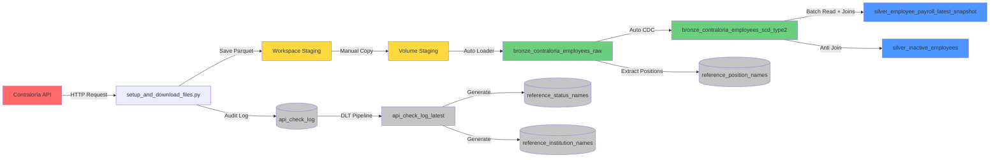

# 🏛️ Public Payroll Pipeline - Office of the Comptroller General of Panama

[](https://www.linkedin.com/in/jquesada92/)
[](https://databricks.com)
[](https://www.python.org/)

## 📋 Overview

Enterprise data pipeline for extracting, processing, and analyzing public employee payroll information from the Republic of Panama, sourced from the official API of the Office of the Comptroller General (Contraloría General de la República).

This project implements a modern data architecture using **Spark Declarative Pipelines (Delta Live Tables)** on **Databricks**, following the **Medallion Architecture** pattern (Bronze → Silver) with advanced historical tracking capabilities via **SCD Type 2** and **Liquid Clustering** for optimized performance.

---

## 🏗️ System Architecture

### Overall Architecture Diagram

```
┌─────────────────────────────────────────────────────────────────────────────┐
│                          MEDALLION ARCHITECTURE                              │
└─────────────────────────────────────────────────────────────────────────────┘

┌──────────────────┐       ┌──────────────────┐       ┌──────────────────┐
│                  │       │                  │       │                  │
│   External API   │──────▶│  Staging Layer   │──────▶│   Bronze Layer   │
│   Contraloría    │       │  (Parquet Files) │       │  (Raw Ingestion) │
│                  │       │                  │       │                  │
└──────────────────┘       └──────────────────┘       └────────┬─────────┘
                                                                │
                           ┌────────────────────────────────────┘
                           │
                           ▼
                    ┌─────────────────┐
                    │                 │
                    │  Bronze SCD-2   │◀─── Auto CDC Flow
                    │  (Historical)   │     (Change Tracking)
                    │                 │
                    └────────┬────────┘
                             │
                             ▼
                    ┌─────────────────┐
                    │                 │
                    │  Silver Layer   │◀─── Materialized View
                    │  (Curated Data) │     (Latest Snapshot)
                    │                 │
                    └─────────────────┘
```

### Detailed Data Flow



---

## 📊 Data Layers

### 🥉 Bronze Layer (Raw Data)

#### `bronze_contraloria_employees_raw`
* **Type**: Streaming Table
* **Source**: Auto Loader (cloudFiles) from Unity Catalog Volume
* **Purpose**: Incremental ingestion of Parquet files
* **Features**:
  * Automatic processing of new files
  * Explicit predefined schema
  * No transformations (raw data from source)
  * **Liquid Clustering** by: `institucion`, `fecha_consulta`
  * Calculated columns: `composite_key`, `antiguedad` (years of service)

#### `bronze_contraloria_employees_scd_type2`
* **Type**: Streaming Table with SCD Type 2
* **Source**: `bronze_contraloria_employees_raw` via Auto CDC
* **Purpose**: Complete change history per employee
* **Primary Keys**:
  * 🔑 `cedula` (ID number)
  * 👤 `nombre` (first name)
  * 👤 `apellido` (last name)
  * 💼 `cargo` (position)
  * 📊 `estado` (status)
* **Tracked Columns** (history):
  * 💰 `salario` (salary)
  * 💵 `gasto` (allowance)
  * 📅 `fecha_de_inicio` (start date)
* **Liquid Clustering** by: `cedula`, `institucion`, `estado`

**SCD Type 2 Visualization:**

```
┌────────────────────────────────────────────────────────────────────┐
│                    SCD Type 2 Record Example                       │
├────────────┬──────────┬─────────┬────────────┬──────────┬─────────┤
│ cedula     │ nombre   │ salario │ __START_AT │ __END_AT │ __ACTION│
├────────────┼──────────┼─────────┼────────────┼──────────┼─────────┤
│ 8-123-4567 │ Juan     │ 1500.00 │ 2025-01-01 │ 2025-06-01│ UPDATE │ ◄── Old version
│ 8-123-4567 │ Juan     │ 1800.00 │ 2025-06-01 │ NULL      │ INSERT │ ◄── Current version
└────────────┴──────────┴─────────┴────────────┴──────────┴─────────┘
```

### 🥈 Silver Layer (Clean & Curated Data)

#### `silver_employee_payroll_latest_snapshot`
* **Type**: Materialized View
* **Source**: `bronze_contraloria_employees_raw` (batch read)
* **Purpose**: Latest employee snapshot with English translations
* **Transformations**:
  * ✅ Joins with reference tables (institutions, statuses, positions)
  * ✅ **Broadcast joins** for dimension tables (performance optimization)
  * ✅ Column translation Spanish → English
  * ✅ Calculated field: `years_of_service`
  * ✅ **Liquid Clustering** by: `institution_sp`, `status_sp`

#### `silver_inactive_employees`
* **Type**: Materialized View
* **Source**: `bronze_contraloria_employees_scd_type2` + `silver_employee_payroll_latest_snapshot`
* **Purpose**: Detect employees marked as active in SCD but missing in latest snapshot
* **Use Cases**:
  * 🚨 Identify employee terminations
  * 🔍 Data quality validation
  * 📊 Track missing records from API
* **Method**: LEFT ANTI JOIN for optimal performance

---

## 📁 Project Structure

```
contraloria_panama/
│
├── 📄 README_ES.md                       # Spanish documentation
├── 📄 README_EN.md                       # English documentation (this file)
│
├── 📄 requirements.txt                   # Python dependencies
├── 🚫 .gitignore                         # Git exclusions
│
├── 🐍 setup_and_download_files.py        # API extraction script
│   ├── Creates catalogs and schemas
│   ├── Creates api_check_log table
│   ├── Downloads data from API
│   ├── Saves to workspace staging folder
│   └── Logs audit trail
│
├── 📂 transformations/
│   ├── 🐍 dlt_pipeline_contraloria.py    # Main DLT pipeline definition
│   │   ├── Bronze: Auto Loader ingestion
│   │   ├── Bronze: Auto CDC (SCD Type 2)
│   │   ├── Silver: Latest snapshot with translations
│   │   └── Silver: Inactive employees detection
│   ├── 🐍 dlt_reference_audit.py         # Reference & audit tables pipeline
│   │   ├── Creates api_check_log_latest (SCD Type 1)
│   │   ├── Generates reference_institution_names
│   │   ├── Generates reference_status_names
│   │   └── Generates reference_position_names
│   └── 🐍 config.py                      # Pipeline configuration (paths, schemas)
│
├── 📂 utils/
│   ├── 🐍 contraloria.py                 # API client utilities
│   ├── 🐍 config.py                      # Global configuration
│   └── 🐍 __init__.py                    # Module initialization
│
└── 📂 staging/                           # Temporary files (workspace, not versioned)
    └── 📊 InformeConsultaPlanilla_*.parquet
```

---

## ⚙️ Pipeline Configuration

### Main Pipeline: `dlt_contraloria`

| Parameter | Value | Description |
|-----------|-------|-------------|
| **Name** | `dlt_contraloria` | Pipeline identifier |
| **Catalog** | `contraloria` | Unity Catalog catalog |
| **Schema** | `employee_payroll` | Target schema for main tables |
| **Compute** | Serverless | No cluster management |
| **Photon** | ✅ Enabled | Optimized execution engine |
| **Mode** | Triggered | On-demand execution |
| **Pipeline Type** | Workspace | Workspace files |
| **Main File** | `/transformations/dlt_pipeline_contraloria.py` | DAG definition |
| **Optimization** | Liquid Clustering | Auto-optimized queries |

### Reference Pipeline: `dlt_reference_audit`

| Parameter | Value | Description |
|-----------|-------|-------------|
| **Name** | `dlt_reference_audit` | Pipeline identifier |
| **Catalog** | `contraloria` | Unity Catalog catalog |
| **Schema** | `reference_and_audit` | Target schema for reference tables |
| **Source** | `api_check_log` + Bronze tables | Generates reference tables |

---

## 🚀 Installation Guide

### Prerequisites

* ✅ Databricks Workspace with Unity Catalog enabled
* ✅ Permissions to create catalogs, schemas, and tables
* ✅ Read/write access in workspace
* ✅ Unity Catalog Volume created: `contraloria.reference_and_audit.contraloria_staging`
* ✅ API credentials (if applicable)

### Step 1️⃣: Configure Database and Extract Data

Run the setup script:

```python
%run ./setup_and_download_files.py
```

**This script performs the following actions:**

1. 🗄️ Creates `contraloria` catalog
2. 📂 Creates `employee_payroll` and `reference_and_audit` schemas
3. 📝 Creates audit table: `api_check_log`
4. 🌐 Extracts data from Contraloría API
5. 💾 Saves Parquet files in workspace `staging/` folder
6. 📊 Logs extraction metadata

**Note**: The script saves files to workspace staging. You need to manually copy them to the Unity Catalog Volume:

```python
# Copy from workspace to volume
source_path = '/Workspace/Users/jaquesada92@outlook.com/contraloria_panama/staging/'
target_path = '/Volumes/contraloria/reference_and_audit/contraloria_staging/'

files = dbutils.fs.ls(source_path)
for file in files:
    dbutils.fs.cp(file.path, target_path + file.name)
```

### Step 2️⃣: Run Reference Pipeline (First Time Only)

The reference tables are created by the DLT pipeline, not by the setup script.

**Run this pipeline first:**

```python
# Navigate to Data Engineering → Pipelines → dlt_reference_audit
# Click ▶️ Start with Full Refresh
```

**This pipeline creates:**
* 📋 `reference_status_names` - Employment statuses (Spanish/English translations via AI)
* 📋 `reference_institution_names` - Public institutions (Spanish/English translations via AI)
* 📋 `reference_position_names` - Job positions (Spanish/English translations via AI)
* 📊 `api_check_log_latest` - Latest API check records (SCD Type 1)

### Step 3️⃣: Run Main Pipeline

**Option A - Web Interface:**

1. Navigate to **Data Engineering** → **Pipelines**
2. Select `dlt_contraloria` pipeline
3. Click **▶️ Start** or **🔄 Start with Full Refresh**
4. Monitor progress in graph view

**Option B - Python Code:**

```python
# Get updates from extraction script
updates = dbutils.jobs.taskValues.get(taskKey="extraction", key="updates")
print(f"Processed {updates} updates")
```

---

## 📊 Data Schema

### Main Table: `silver_employee_payroll_latest_snapshot`

**Full path**: `contraloria.employee_payroll.silver_employee_payroll_latest_snapshot`

| Column | Type | Nullable | Description | Example |
|---------|------|---------|-------------|---------|
| `composite_key` | STRING | ❌ | Unique composite identifier | `JUAN-RODRIGUEZ-TRIBUNAL-ANALYST-8123...` |
| `first_name` | STRING | ✅ | Employee first name(s) | `JUAN CARLOS` |
| `last_name` | STRING | ✅ | Employee last name(s) | `RODRIGUEZ PEREZ` |
| `id_number` | STRING | ❌ | Employee ID number | `8-123-4567` |
| `salary` | DOUBLE | ✅ | Monthly base salary (USD) | `1500.00` |
| `allowance` | DOUBLE | ✅ | Representation allowance (USD) | `300.00` |
| `status_sp` | STRING | ✅ | Employment status (Spanish) | `PERMANENTE` |
| `status_en` | STRING | ✅ | Employment status (English) | `PERMANENT` |
| `institution_sp` | STRING | ✅ | Institution (Spanish) | `TRIBUNAL ELECTORAL` |
| `institution_en` | STRING | ✅ | Institution (English) | `ELECTORAL COURT` |
| `position_sp` | STRING | ✅ | Position (Spanish) | `ANALISTA` |
| `position_en` | STRING | ✅ | Position (English) | `ANALYST` |
| `start_date` | DATE | ✅ | Position start date | `2020-01-15` |
| `query_date` | TIMESTAMP | ✅ | Update date from source | `2025-01-15 00:00:00` |
| `snapshot_date` | TIMESTAMP | ✅ | Query/extraction date | `2025-01-15 12:00:00` |
| `years_of_service` | DOUBLE | ✅ | Years in position | `4.5` |
| `file` | STRING | ✅ | Source file name | `InformeConsultaPlanilla_2025-01.parquet` |

### Inactive Employees Table: `silver_inactive_employees`

**Full path**: `contraloria.employee_payroll.silver_inactive_employees`

| Column | Type | Description |
|---------|------|-------------|
| `cedula` | STRING | Employee ID number |
| `nombre` | STRING | First name |
| `apellido` | STRING | Last name |
| `cargo` | STRING | Position |
| `estado` | STRING | Status |
| `institucion` | STRING | Institution |
| `salario` | DOUBLE | Last known salary |
| `gasto` | DOUBLE | Last known allowance |
| `fecha_de_inicio` | DATE | Start date |
| `__START_AT` | TIMESTAMP | When record became active in SCD |

### Keys and Constraints

**Primary Keys (SCD Type 2):**
* `(cedula, nombre, apellido, cargo, estado)`

**Sequence Column**: `fecha_consulta` (for temporal ordering in CDC)

**Clustering Keys:**
* **Bronze Raw**: `(institucion, fecha_consulta)`
* **Bronze SCD-2**: `(cedula, institucion, estado)`
* **Silver Snapshot**: `(institution_sp, status_sp)`

---

## 🔄 Update Process

### Complete Workflow

```
┌─────────────────────────────────────────────────────────────────────┐
│ STEP 1: EXTRACTION                                                  │
├─────────────────────────────────────────────────────────────────────┤
│ 1. Script queries Contraloría API                                   │
│ 2. Checks last update date in source                                │
│ 3. Downloads only new/modified records                              │
│ 4. Saves in optimized Parquet format to workspace staging/          │
│ 5. Logs metadata in audit table                                     │
└─────────────────────────────────────────────────────────────────────┘
                             ⬇️
┌─────────────────────────────────────────────────────────────────────┐
│ STEP 1.5: MANUAL COPY (TEMPORARY)                                   │
├─────────────────────────────────────────────────────────────────────┤
│ Copy files from workspace staging/ to Unity Catalog Volume          │
│ Path: /Volumes/contraloria/reference_and_audit/contraloria_staging  │
└─────────────────────────────────────────────────────────────────────┘
                             ⬇️
┌─────────────────────────────────────────────────────────────────────┐
│ STEP 2: REFERENCE TABLES (DLT Reference Pipeline)                   │
├─────────────────────────────────────────────────────────────────────┤
│ 1. Reads api_check_log table                                        │
│ 2. Creates api_check_log_latest (SCD Type 1)                        │
│ 3. Generates reference_institution_names with translations          │
│ 4. Generates reference_status_names with translations               │
│ 5. Extracts positions from bronze and generates translations        │
└─────────────────────────────────────────────────────────────────────┘
                             ⬇️
┌─────────────────────────────────────────────────────────────────────┐
│ STEP 3: INGESTION (BRONZE RAW)                                      │
├─────────────────────────────────────────────────────────────────────┤
│ 1. Auto Loader detects new files in Volume staging/                 │
│ 2. Reads only unprocessed files                                     │
│ 3. Applies explicit predefined schema                               │
│ 4. Writes to bronze_contraloria_employees_raw                       │
│ 5. Adds composite_key and antiguedad columns                        │
└─────────────────────────────────────────────────────────────────────┘
                             ⬇️
┌─────────────────────────────────────────────────────────────────────┐
│ STEP 4: HISTORIZATION (BRONZE SCD-2)                                │
├─────────────────────────────────────────────────────────────────────┤
│ 1. Auto CDC reads stream from bronze_contraloria_employees_raw      │
│ 2. Detects INSERTs, UPDATEs based on composite keys                 │
│ 3. Closes old records (__END_AT = timestamp)                        │
│ 4. Inserts new versions (__END_AT = NULL)                           │
│ 5. Adds __START_AT, __END_AT, __ACTION columns                      │
│ 6. Tracks history for: salario, gasto, fecha_de_inicio              │
└─────────────────────────────────────────────────────────────────────┘
                             ⬇️
┌─────────────────────────────────────────────────────────────────────┐
│ STEP 5: CURATION (SILVER)                                           │
├─────────────────────────────────────────────────────────────────────┤
│ 1. Batch reads from bronze_contraloria_employees_raw                │
│ 2. Broadcast joins with reference tables                            │
│ 3. Translates columns Spanish → English                             │
│ 4. Calculates years_of_service                                      │
│ 5. Materializes optimized view with Liquid Clustering               │
│ 6. Detects inactive employees via anti-join                         │
└─────────────────────────────────────────────────────────────────────┘
```

### Recommended Frequency

| Process | Suggested Frequency | Reason |
|---------|---------------------|-------|
| **API Extraction** | Monthly | Source updates monthly |
| **File Copy to Volume** | Post-extraction | Manual step (temporary) |
| **Reference Pipeline** | Post-extraction | Generate translations for new data |
| **Main DLT Pipeline** | Post-reference pipeline | Process only when new data arrives |
| **Monitoring** | Daily | Validate quality and completeness |

---

## 📈 Analysis Queries

### 1️⃣ Employees by Institution

```sql
SELECT 
  institution_en,
  COUNT(*) as total_employees,
  SUM(salary) as total_salary_budget,
  SUM(allowance) as total_allowance_budget,
  AVG(salary) as avg_salary,
  MAX(salary) as max_salary
FROM contraloria.employee_payroll.silver_employee_payroll_latest_snapshot
GROUP BY institution_en
ORDER BY total_employees DESC;
```

**Expected output:**
```
┌───────────────────────────┬──────────────────┬──────────────────────┐
│ institution_en            │ total_employees  │ total_salary_budget  │
├───────────────────────────┼──────────────────┼──────────────────────┤
│ ELECTORAL COURT           │ 2,450            │ 4,125,000.00         │
│ COURT OF ACCOUNTS         │ 1,890            │ 3,215,500.00         │
│ ADMINISTRATIVE COURT      │ 1,234            │ 2,100,300.00         │
└───────────────────────────┴──────────────────┴──────────────────────┘
```

### 2️⃣ Top 100 Highest Salaries

```sql
SELECT 
  id_number,
  CONCAT(first_name, ' ', last_name) as full_name,
  institution_en,
  position_en,
  salary,
  allowance,
  (salary + allowance) as total_compensation
FROM contraloria.employee_payroll.silver_employee_payroll_latest_snapshot
ORDER BY total_compensation DESC
LIMIT 100;
```

### 3️⃣ Complete Employee History

```sql
SELECT 
  cedula,
  nombre,
  apellido,
  cargo,
  salario,
  estado,
  __START_AT as valid_from,
  COALESCE(__END_AT, CURRENT_TIMESTAMP()) as valid_to,
  __ACTION as change_type
FROM contraloria.employee_payroll.bronze_contraloria_employees_scd_type2
WHERE cedula = '8-123-4567'
ORDER BY __START_AT DESC;
```

### 4️⃣ Distribution by Employment Status

```sql
SELECT 
  status_en,
  COUNT(*) as employee_count,
  ROUND(COUNT(*) * 100.0 / SUM(COUNT(*)) OVER(), 2) as percentage
FROM contraloria.employee_payroll.silver_employee_payroll_latest_snapshot
GROUP BY status_en
ORDER BY employee_count DESC;
```

### 5️⃣ Average Years of Service by Institution

```sql
SELECT 
  institution_en,
  AVG(years_of_service) as avg_years_service,
  MIN(years_of_service) as min_years,
  MAX(years_of_service) as max_years
FROM contraloria.employee_payroll.silver_employee_payroll_latest_snapshot
GROUP BY institution_en
ORDER BY avg_years_service DESC;
```

### 6️⃣ Inactive Employees (Potential Terminations)

```sql
SELECT 
  cedula,
  CONCAT(nombre, ' ', apellido) as full_name,
  institucion,
  cargo,
  estado,
  salario,
  __START_AT as became_active_on
FROM contraloria.employee_payroll.silver_inactive_employees
ORDER BY __START_AT DESC
LIMIT 100;
```

---

## 🛠️ Maintenance and Operations

### Monitoring

#### 1. Pipeline Status
```python
# Check last update
from databricks import pipelines
pipeline_id = "ffbae848-bc88-4c0e-89a3-32768ee1fc79"
# View details in pipeline UI
```

#### 2. API Audit Logs
```sql
SELECT 
  institution_name_spanish,
  status_name_spanish,
  run_status,
  source_update,
  checked_at,
  time as execution_time_seconds
FROM contraloria.reference_and_audit.api_check_log
WHERE checked_at >= CURRENT_DATE() - INTERVAL 7 DAYS
ORDER BY checked_at DESC;
```

#### 3. Data Quality - Check for Missing Records
```sql
-- Count inactive employees (present in SCD but not in latest snapshot)
SELECT COUNT(*) as inactive_count
FROM contraloria.employee_payroll.silver_inactive_employees;

-- Compare record counts
SELECT 
  'SCD Active Records' as source,
  COUNT(*) as count
FROM contraloria.employee_payroll.bronze_contraloria_employees_scd_type2
WHERE __END_AT IS NULL

UNION ALL

SELECT 
  'Latest Snapshot' as source,
  COUNT(*) as count
FROM contraloria.employee_payroll.silver_employee_payroll_latest_snapshot;
```

### Staging Cleanup

```python
# Clean workspace staging files (after copying to volume)
staging_path = '/Workspace/Users/jaquesada92@outlook.com/contraloria_panama/staging/'

# List files
files = dbutils.fs.ls(staging_path)
print(f"Total files: {len(files)}")

# Delete all staging files (after confirming pipeline ran successfully)
dbutils.fs.rm(staging_path, recurse=True)
dbutils.fs.mkdirs(staging_path)
```

### Schema Updates

If the API adds new columns:

1. Modify `STAGING_SCHEMA` in `transformations/config.py`
2. Update transformations in Silver layer in `dlt_pipeline_contraloria.py`
3. Execute **Full Refresh** of both pipelines

---

## 📝 Dependencies

**Python Libraries** (`requirements.txt`):
* `openpyxl` - Read Excel/XLSX files from the API

**Databricks Runtime**:
* DBR 14.0+ recommended
* Unity Catalog enabled
* Serverless pipelines with Photon

---

## 📊 Data Visualization & Dashboards

### Power BI Dashboard

An interactive Power BI dashboard has been created to visualize and analyze the payroll data from the `silver_employee_payroll_latest_snapshot` table.

**🔗 Access Dashboard**: [Panama Public Payroll Analysis - Power BI](https://app.powerbi.com/view?r=eyJrIjoiOGUxOTk0ZWEtODg2NC00NDEzLTllMWYtOTdkMjkxMWE3ZWU3IiwidCI6IjBhNzk5NDU0LTM1NTAtNGZiNi1iNGMzLWY5ZWIzMmVhOWU2NCJ9)

**Dashboard Features:**
* 📊 Employee distribution by institution
* 💰 Salary and allowance analysis
* 📈 Historical trends and comparisons
* 🔍 Interactive filters and drill-downs
* 📋 Key performance indicators (KPIs)

---

## 🔗 Links and Resources

* 🏛️ **Main Pipeline**: [dlt_contraloria](#pipeline-ffbae848-bc88-4c0e-89a3-32768ee1fc79)
* 🏛️ **Reference Pipeline**: [dlt_reference_audit](#pipeline)
* 📊 **Main Table**: [silver_employee_payroll_latest_snapshot](#table)
* 📊 **Power BI Dashboard**: [Panama Public Payroll Analysis](https://app.powerbi.com/view?r=eyJrIjoiOGUxOTk0ZWEtODg2NC00NDEzLTllMWYtOTdkMjkxMWE3ZWU3IiwidCI6IjBhNzk5NDU0LTM1NTAtNGZiNi1iNGMzLWY5ZWIzMmVhOWU2NCJ9)
* 📚 **DLT Documentation**: [docs.databricks.com/delta-live-tables](https://docs.databricks.com/delta-live-tables/)
* 🔗 **Liquid Clustering**: [docs.databricks.com/delta/liquid-clustering](https://docs.databricks.com/delta/clustering.html)
* 🌐 **Contraloría API**: [Official website](https://www.contraloria.gob.pa/)

---

## 👤 Author

**Jose Quesada**  
📧 Email: jaquesada92@outlook.com  
💼 LinkedIn: [linkedin.com/in/jquesada92](https://www.linkedin.com/in/jquesada92/)

---

## 📄 License

This project is for educational and demonstration purposes.

---

*Last updated: January 2025*  
*Version: 2.1*
