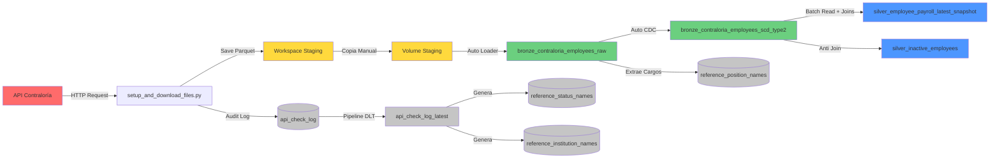

# 🏛️ Pipeline de Nómina - Contraloría General de la República de Panamá

[](https://www.linkedin.com/in/jquesada92/)
[](https://databricks.com)
[](https://www.python.org/)

## 📋 Descripción

Pipeline de datos empresarial para la extracción, procesamiento y análisis de información de nómina de empleados públicos de la República de Panamá, obtenida desde la API oficial de la Contraloría General de la República.

Este proyecto implementa una arquitectura de datos moderna utilizando **Spark Declarative Pipelines (Delta Live Tables)** en **Databricks**, siguiendo el patrón **Medallion Architecture** (Bronze → Silver) con capacidades avanzadas de seguimiento histórico mediante **SCD Type 2** y **Liquid Clustering** para optimización de rendimiento.

---

## 🏗️ Arquitectura del Sistema

### Diagrama de Arquitectura General

```
┌─────────────────────────────────────────────────────────────────────────────┐
│                          ARQUITECTURA MEDALLION                              │
└─────────────────────────────────────────────────────────────────────────────┘

┌──────────────────┐       ┌──────────────────┐       ┌──────────────────┐
│                  │       │                  │       │                  │
│   API Externa    │──────▶│  Staging Layer   │──────▶│   Bronze Layer   │
│   Contraloría    │       │  (Parquet Files) │       │  (Raw Ingestion) │
│                  │       │                  │       │                  │
└──────────────────┘       └──────────────────┘       └────────┬─────────┘
                                                                │
                           ┌────────────────────────────────────┘
                           │
                           ▼
                    ┌─────────────────┐
                    │                 │
                    │  Bronze SCD-2   │◀─── Auto CDC Flow
                    │  (Historical)   │     (Change Tracking)
                    │                 │
                    └────────┬────────┘
                             │
                             ▼
                    ┌─────────────────┐
                    │                 │
                    │  Silver Layer   │◀─── Materialized View
                    │  (Curated Data) │     (Snapshot Actual)
                    │                 │
                    └─────────────────┘
```

### Flujo de Datos Detallado



---

## 📊 Capas de Datos

### 🥉 Bronze Layer (Datos Crudos)

#### `bronze_contraloria_employees_raw`
* **Tipo**: Streaming Table
* **Fuente**: Auto Loader (cloudFiles) desde Unity Catalog Volume
* **Propósito**: Ingesta incremental de archivos Parquet
* **Características**:
  * Procesamiento automático de nuevos archivos
  * Esquema explícito predefinido
  * Sin transformaciones (datos tal cual desde la fuente)
  * **Liquid Clustering** por: `institucion`, `fecha_consulta`
  * Columnas calculadas: `composite_key`, `antiguedad` (años de servicio)

#### `bronze_contraloria_employees_scd_type2`
* **Tipo**: Streaming Table con SCD Type 2
* **Fuente**: `bronze_contraloria_employees_raw` via Auto CDC
* **Propósito**: Historial completo de cambios por empleado
* **Claves Primarias**:
  * 🔑 `cedula` (cédula)
  * 👤 `nombre` (nombre)
  * 👤 `apellido` (apellido)
  * 💼 `cargo` (cargo)
  * 📊 `estado` (estado)
* **Columnas Rastreadas** (historial):
  * 💰 `salario` (salario)
  * 💵 `gasto` (gastos de representación)
  * 📅 `fecha_de_inicio` (fecha de inicio)
* **Liquid Clustering** por: `cedula`, `institucion`, `estado`

**Visualización de SCD Type 2:**

```
┌────────────────────────────────────────────────────────────────────┐
│                    Registro SCD Type 2 Example                     │
├────────────┬──────────┬─────────┬────────────┬──────────┬─────────┤
│ cedula     │ nombre   │ salario │ __START_AT │ __END_AT │ __ACTION│
├────────────┼──────────┼─────────┼────────────┼──────────┼─────────┤
│ 8-123-4567 │ Juan     │ 1500.00 │ 2025-01-01 │ 2025-06-01│ UPDATE │ ◄── Versión antigua
│ 8-123-4567 │ Juan     │ 1800.00 │ 2025-06-01 │ NULL      │ INSERT │ ◄── Versión actual
└────────────┴──────────┴─────────┴────────────┴──────────┴─────────┘
```

### 🥈 Silver Layer (Datos Limpios y Curados)

#### `silver_employee_payroll_latest_snapshot`
* **Tipo**: Materialized View
* **Fuente**: `bronze_contraloria_employees_raw` (batch read)
* **Propósito**: Snapshot actual de empleados con traducciones al inglés
* **Transformaciones**:
  * ✅ Joins con tablas de referencia (instituciones, estados, cargos)
  * ✅ **Broadcast joins** para tablas de dimensión (optimización de rendimiento)
  * ✅ Traducción de columnas español → inglés
  * ✅ Campo calculado: `years_of_service` (años de servicio)
  * ✅ **Liquid Clustering** por: `institution_sp`, `status_sp`

#### `silver_inactive_employees`
* **Tipo**: Materialized View
* **Fuente**: `bronze_contraloria_employees_scd_type2` + `silver_employee_payroll_latest_snapshot`
* **Propósito**: Detectar empleados marcados como activos en SCD pero ausentes en último snapshot
* **Casos de Uso**:
  * 🚨 Identificar terminaciones de empleados
  * 🔍 Validación de calidad de datos
  * 📊 Rastrear registros faltantes de la API
* **Método**: LEFT ANTI JOIN para rendimiento óptimo

---

## 📁 Estructura del Proyecto

```
contraloria_panama/
│
├── 📄 README_ES.md                       # Documentación en español (este archivo)
├── 📄 README_EN.md                       # Documentación en inglés
│
├── 📄 requirements.txt                   # Dependencias Python
├── 🚫 .gitignore                         # Exclusiones de Git
│
├── 🐍 setup_and_download_files.py        # Script de extracción API
│   ├── Crea catálogos y esquemas
│   ├── Crea tabla api_check_log
│   ├── Descarga datos desde API
│   ├── Guarda en staging del workspace
│   └── Registra auditoría
│
├── 📂 transformations/
│   ├── 🐍 dlt_pipeline_contraloria.py    # Definición principal del pipeline DLT
│   │   ├── Bronze: Auto Loader ingestion
│   │   ├── Bronze: Auto CDC (SCD Type 2)
│   │   ├── Silver: Snapshot actual con traducciones
│   │   └── Silver: Detección de empleados inactivos
│   ├── 🐍 dlt_reference_audit.py         # Pipeline de tablas de referencia y auditoría
│   │   ├── Crea api_check_log_latest (SCD Type 1)
│   │   ├── Genera reference_institution_names
│   │   ├── Genera reference_status_names
│   │   └── Genera reference_position_names
│   └── 🐍 config.py                      # Configuración del pipeline (rutas, esquemas)
│
├── 📂 utils/
│   ├── 🐍 contraloria.py                 # Utilidades del cliente API
│   ├── 🐍 config.py                      # Configuración global
│   └── 🐍 __init__.py                    # Inicialización del módulo
│
└── 📂 staging/                           # Archivos temporales (workspace, no versionados)
    └── 📊 InformeConsultaPlanilla_*.parquet
```

---

## ⚙️ Configuración del Pipeline

### Pipeline Principal: `dlt_contraloria`

| Parámetro | Valor | Descripción |
|-----------|-------|-------------|
| **Nombre** | `dlt_contraloria` | Identificador del pipeline |
| **Catalog** | `contraloria` | Catálogo de Unity Catalog |
| **Schema** | `employee_payroll` | Esquema de destino para tablas principales |
| **Compute** | Serverless | Sin gestión de clusters |
| **Photon** | ✅ Habilitado | Motor de ejecución optimizado |
| **Modo** | Triggered | Ejecución bajo demanda |
| **Pipeline Type** | Workspace | Archivos en workspace |
| **Archivo Principal** | `/transformations/dlt_pipeline_contraloria.py` | Definición del DAG |
| **Optimización** | Liquid Clustering | Queries auto-optimizadas |

### Pipeline de Referencia: `dlt_reference_audit`

| Parámetro | Valor | Descripción |
|-----------|-------|-------------|
| **Nombre** | `dlt_reference_audit` | Identificador del pipeline |
| **Catalog** | `contraloria` | Catálogo de Unity Catalog |
| **Schema** | `reference_and_audit` | Esquema de destino para tablas de referencia |
| **Fuente** | `api_check_log` + Tablas Bronze | Genera tablas de referencia |

---

## 🚀 Guía de Instalación

### Requisitos Previos

* ✅ Databricks Workspace con Unity Catalog habilitado
* ✅ Permisos para crear catálogos, esquemas y tablas
* ✅ Acceso de lectura/escritura en workspace
* ✅ Unity Catalog Volume creado: `contraloria.reference_and_audit.contraloria_staging`
* ✅ Credenciales de API (si aplica)

### Paso 1️⃣: Configurar Base de Datos y Extraer Datos

Ejecuta el script de configuración:

```python
%run ./setup_and_download_files.py
```

**Este script realiza las siguientes acciones:**

1. 🗄️ Crea el catálogo `contraloria`
2. 📂 Crea esquemas `employee_payroll` y `reference_and_audit`
3. 📝 Crea tabla de auditoría: `api_check_log`
4. 🌐 Extrae datos desde la API de la Contraloría
5. 💾 Guarda archivos Parquet en carpeta `staging/` del workspace
6. 📊 Registra metadata de extracción

**Nota**: El script guarda archivos en staging del workspace. Necesitas copiarlos manualmente al Unity Catalog Volume:

```python
# Copiar desde workspace al volume
source_path = '/Workspace/Users/jaquesada92@outlook.com/contraloria_panama/staging/'
target_path = '/Volumes/contraloria/reference_and_audit/contraloria_staging/'

files = dbutils.fs.ls(source_path)
for file in files:
    dbutils.fs.cp(file.path, target_path + file.name)
```

### Paso 2️⃣: Ejecutar Pipeline de Referencia (Solo Primera Vez)

Las tablas de referencia son creadas por el pipeline DLT, no por el script de configuración.

**Ejecuta este pipeline primero:**

```python
# Navega a Data Engineering → Pipelines → dlt_reference_audit
# Haz clic en ▶️ Start with Full Refresh
```

**Este pipeline crea:**
* 📋 `reference_status_names` - Estados laborales (traducciones español/inglés vía IA)
* 📋 `reference_institution_names` - Instituciones públicas (traducciones español/inglés vía IA)
* 📋 `reference_position_names` - Cargos (traducciones español/inglés vía IA)
* 📊 `api_check_log_latest` - Registros más recientes de verificación de API (SCD Type 1)

### Paso 3️⃣: Ejecutar Pipeline Principal

**Opción A - Interfaz Web:**

1. Navega a **Data Engineering** → **Pipelines**
2. Selecciona el pipeline `dlt_contraloria`
3. Haz clic en **▶️ Start** o **🔄 Start with Full Refresh**
4. Monitorea el progreso en la vista de gráfico

**Opción B - Código Python:**

```python
# Obtener actualizaciones del script de extracción
updates = dbutils.jobs.taskValues.get(taskKey="extraction", key="updates")
print(f"Procesadas {updates} actualizaciones")
```

---

## 📊 Esquema de Datos

### Tabla Principal: `silver_employee_payroll_latest_snapshot`

**Ruta completa**: `contraloria.employee_payroll.silver_employee_payroll_latest_snapshot`

| Columna | Tipo | Nullable | Descripción | Ejemplo |
|---------|------|---------|-------------|---------|
| `composite_key` | STRING | ❌ | Identificador compuesto único | `JUAN-RODRIGUEZ-TRIBUNAL-ANALYST-8123...` |
| `first_name` | STRING | ✅ | Nombre(s) del empleado | `JUAN CARLOS` |
| `last_name` | STRING | ✅ | Apellido(s) del empleado | `RODRIGUEZ PEREZ` |
| `id_number` | STRING | ❌ | Número de cédula | `8-123-4567` |
| `salary` | DOUBLE | ✅ | Salario base mensual (USD) | `1500.00` |
| `allowance` | DOUBLE | ✅ | Gastos de representación (USD) | `300.00` |
| `status_sp` | STRING | ✅ | Estado laboral (español) | `PERMANENTE` |
| `status_en` | STRING | ✅ | Estado laboral (inglés) | `PERMANENT` |
| `institution_sp` | STRING | ✅ | Institución (español) | `TRIBUNAL ELECTORAL` |
| `institution_en` | STRING | ✅ | Institución (inglés) | `ELECTORAL COURT` |
| `position_sp` | STRING | ✅ | Cargo (español) | `ANALISTA` |
| `position_en` | STRING | ✅ | Cargo (inglés) | `ANALYST` |
| `start_date` | DATE | ✅ | Fecha de inicio en el cargo | `2020-01-15` |
| `query_date` | TIMESTAMP | ✅ | Fecha de actualización de la fuente | `2025-01-15 00:00:00` |
| `snapshot_date` | TIMESTAMP | ✅ | Fecha de consulta/extracción | `2025-01-15 12:00:00` |
| `years_of_service` | DOUBLE | ✅ | Años en el cargo | `4.5` |
| `file` | STRING | ✅ | Nombre del archivo fuente | `InformeConsultaPlanilla_2025-01.parquet` |

### Tabla de Empleados Inactivos: `silver_inactive_employees`

**Ruta completa**: `contraloria.employee_payroll.silver_inactive_employees`

| Columna | Tipo | Descripción |
|---------|------|-------------|
| `cedula` | STRING | Número de cédula |
| `nombre` | STRING | Nombre |
| `apellido` | STRING | Apellido |
| `cargo` | STRING | Cargo |
| `estado` | STRING | Estado |
| `institucion` | STRING | Institución |
| `salario` | DOUBLE | Último salario conocido |
| `gasto` | DOUBLE | Último gasto conocido |
| `fecha_de_inicio` | DATE | Fecha de inicio |
| `__START_AT` | TIMESTAMP | Cuando el registro se volvió activo en SCD |

### Claves y Restricciones

**Claves Primarias (SCD Type 2):**
* `(cedula, nombre, apellido, cargo, estado)`

**Columna de Secuencia**: `fecha_consulta` (para ordenamiento temporal en CDC)

**Claves de Clustering:**
* **Bronze Raw**: `(institucion, fecha_consulta)`
* **Bronze SCD-2**: `(cedula, institucion, estado)`
* **Silver Snapshot**: `(institution_sp, status_sp)`

---

## 🔄 Proceso de Actualización

### Flujo Completo

```
┌─────────────────────────────────────────────────────────────────────┐
│ PASO 1: EXTRACCIÓN                                                  │
├─────────────────────────────────────────────────────────────────────┤
│ 1. Script consulta la API de la Contraloría                         │
│ 2. Verifica la última fecha de actualización en la fuente           │
│ 3. Descarga solo registros nuevos/modificados                       │
│ 4. Guarda en formato Parquet optimizado en workspace staging/       │
│ 5. Registra metadata en tabla de auditoría                          │
└─────────────────────────────────────────────────────────────────────┘
                             ⬇️
┌─────────────────────────────────────────────────────────────────────┐
│ PASO 1.5: COPIA MANUAL (TEMPORAL)                                   │
├─────────────────────────────────────────────────────────────────────┤
│ Copiar archivos desde staging/ del workspace a Unity Catalog Volume │
│ Ruta: /Volumes/contraloria/reference_and_audit/contraloria_staging  │
└─────────────────────────────────────────────────────────────────────┘
                             ⬇️
┌─────────────────────────────────────────────────────────────────────┐
│ PASO 2: TABLAS DE REFERENCIA (Pipeline DLT de Referencia)           │
├─────────────────────────────────────────────────────────────────────┤
│ 1. Lee tabla api_check_log                                          │
│ 2. Crea api_check_log_latest (SCD Type 1)                           │
│ 3. Genera reference_institution_names con traducciones              │
│ 4. Genera reference_status_names con traducciones                   │
│ 5. Extrae cargos de bronze y genera traducciones                    │
└─────────────────────────────────────────────────────────────────────┘
                             ⬇️
┌─────────────────────────────────────────────────────────────────────┐
│ PASO 3: INGESTA (BRONZE RAW)                                        │
├─────────────────────────────────────────────────────────────────────┤
│ 1. Auto Loader detecta archivos nuevos en Volume staging/           │
│ 2. Lee solo archivos no procesados                                  │
│ 3. Aplica esquema explícito predefinido                             │
│ 4. Escribe a bronze_contraloria_employees_raw                       │
│ 5. Añade columnas composite_key y antiguedad                        │
└─────────────────────────────────────────────────────────────────────┘
                             ⬇️
┌─────────────────────────────────────────────────────────────────────┐
│ PASO 4: HISTORIZACIÓN (BRONZE SCD-2)                                │
├─────────────────────────────────────────────────────────────────────┤
│ 1. Auto CDC lee stream de bronze_contraloria_employees_raw          │
│ 2. Detecta INSERTs, UPDATEs basado en claves compuestas             │
│ 3. Cierra registros antiguos (__END_AT = timestamp)                 │
│ 4. Inserta versiones nuevas (__END_AT = NULL)                       │
│ 5. Añade columnas __START_AT, __END_AT, __ACTION                    │
│ 6. Rastrea historial de: salario, gasto, fecha_de_inicio            │
└─────────────────────────────────────────────────────────────────────┘
                             ⬇️
┌─────────────────────────────────────────────────────────────────────┐
│ PASO 5: CURACIÓN (SILVER)                                           │
├─────────────────────────────────────────────────────────────────────┤
│ 1. Lee en batch de bronze_contraloria_employees_raw                 │
│ 2. Joins broadcast con tablas de referencia                         │
│ 3. Traduce columnas español → inglés                                │
│ 4. Calcula years_of_service                                         │
│ 5. Materializa vista optimizada con Liquid Clustering               │
│ 6. Detecta empleados inactivos vía anti-join                        │
└─────────────────────────────────────────────────────────────────────┘
```

### Frecuencia Recomendada

| Proceso | Frecuencia Sugerida | Razón |
|---------|---------------------|-------|
| **Extracción API** | Mensual | Fuente se actualiza mensualmente |
| **Copia a Volume** | Post-extracción | Paso manual (temporal) |
| **Pipeline de Referencia** | Post-extracción | Generar traducciones para datos nuevos |
| **Pipeline DLT Principal** | Post-pipeline de referencia | Procesar solo cuando llegan datos nuevos |
| **Monitoreo** | Diario | Validar calidad y completitud |

---

## 📈 Consultas de Análisis

### 1️⃣ Empleados por Institución

```sql
SELECT 
  institution_en,
  COUNT(*) as total_empleados,
  SUM(salary) as presupuesto_salarios,
  SUM(allowance) as presupuesto_gastos,
  AVG(salary) as salario_promedio,
  MAX(salary) as salario_maximo
FROM contraloria.employee_payroll.silver_employee_payroll_latest_snapshot
GROUP BY institution_en
ORDER BY total_empleados DESC;
```

**Resultado esperado:**
```
┌───────────────────────────┬──────────────────┬──────────────────────┐
│ institution_en            │ total_empleados  │ presupuesto_salarios │
├───────────────────────────┼──────────────────┼──────────────────────┤
│ ELECTORAL COURT           │ 2,450            │ 4,125,000.00         │
│ COURT OF ACCOUNTS         │ 1,890            │ 3,215,500.00         │
│ ADMINISTRATIVE COURT      │ 1,234            │ 2,100,300.00         │
└───────────────────────────┴──────────────────┴──────────────────────┘
```

### 2️⃣ Top 100 Salarios Más Altos

```sql
SELECT 
  id_number,
  CONCAT(first_name, ' ', last_name) as nombre_completo,
  institution_en,
  position_en,
  salary,
  allowance,
  (salary + allowance) as compensacion_total
FROM contraloria.employee_payroll.silver_employee_payroll_latest_snapshot
ORDER BY compensacion_total DESC
LIMIT 100;
```

### 3️⃣ Historial Completo de un Empleado

```sql
SELECT 
  cedula,
  nombre,
  apellido,
  cargo,
  salario,
  estado,
  __START_AT as vigente_desde,
  COALESCE(__END_AT, CURRENT_TIMESTAMP()) as vigente_hasta,
  __ACTION as tipo_cambio
FROM contraloria.employee_payroll.bronze_contraloria_employees_scd_type2
WHERE cedula = '8-123-4567'
ORDER BY __START_AT DESC;
```

### 4️⃣ Distribución por Estado Laboral

```sql
SELECT 
  status_en,
  COUNT(*) as cantidad_empleados,
  ROUND(COUNT(*) * 100.0 / SUM(COUNT(*)) OVER(), 2) as porcentaje
FROM contraloria.employee_payroll.silver_employee_payroll_latest_snapshot
GROUP BY status_en
ORDER BY cantidad_empleados DESC;
```

### 5️⃣ Promedio de Años de Servicio por Institución

```sql
SELECT 
  institution_en,
  AVG(years_of_service) as promedio_anos_servicio,
  MIN(years_of_service) as minimo_anos,
  MAX(years_of_service) as maximo_anos
FROM contraloria.employee_payroll.silver_employee_payroll_latest_snapshot
GROUP BY institution_en
ORDER BY promedio_anos_servicio DESC;
```

### 6️⃣ Empleados Inactivos (Posibles Terminaciones)

```sql
SELECT 
  cedula,
  CONCAT(nombre, ' ', apellido) as nombre_completo,
  institucion,
  cargo,
  estado,
  salario,
  __START_AT as se_activo_en
FROM contraloria.employee_payroll.silver_inactive_employees
ORDER BY __START_AT DESC
LIMIT 100;
```

---

## 🛠️ Mantenimiento y Operaciones

### Monitoreo

#### 1. Estado del Pipeline
```python
# Verificar última actualización
from databricks import pipelines
pipeline_id = "ffbae848-bc88-4c0e-89a3-32768ee1fc79"
# Ver detalles en la UI del pipeline
```

#### 2. Logs de Auditoría de API
```sql
SELECT 
  institution_name_spanish,
  status_name_spanish,
  run_status,
  source_update,
  checked_at,
  time as tiempo_ejecucion_segundos
FROM contraloria.reference_and_audit.api_check_log
WHERE checked_at >= CURRENT_DATE() - INTERVAL 7 DAYS
ORDER BY checked_at DESC;
```

#### 3. Calidad de Datos - Verificar Registros Faltantes
```sql
-- Contar empleados inactivos (presentes en SCD pero no en último snapshot)
SELECT COUNT(*) as cantidad_inactivos
FROM contraloria.employee_payroll.silver_inactive_employees;

-- Comparar conteos de registros
SELECT 
  'Registros Activos SCD' as fuente,
  COUNT(*) as cantidad
FROM contraloria.employee_payroll.bronze_contraloria_employees_scd_type2
WHERE __END_AT IS NULL

UNION ALL

SELECT 
  'Último Snapshot' as fuente,
  COUNT(*) as cantidad
FROM contraloria.employee_payroll.silver_employee_payroll_latest_snapshot;
```

### Limpieza de Staging

```python
# Limpiar archivos de staging del workspace (después de copiar a volume)
staging_path = '/Workspace/Users/jaquesada92@outlook.com/contraloria_panama/staging/'

# Listar archivos
files = dbutils.fs.ls(staging_path)
print(f"Total de archivos: {len(files)}")

# Eliminar todos los archivos de staging (después de confirmar que el pipeline corrió exitosamente)
dbutils.fs.rm(staging_path, recurse=True)
dbutils.fs.mkdirs(staging_path)
```

### Actualizaciones de Esquema

Si la API añade nuevas columnas:

1. Modificar `STAGING_SCHEMA` en `transformations/config.py`
2. Actualizar transformaciones en capa Silver en `dlt_pipeline_contraloria.py`
3. Ejecutar **Full Refresh** de ambos pipelines

---

## 📝 Dependencias

**Librerías Python** (`requirements.txt`):
* `openpyxl` - Leer archivos Excel/XLSX de la API

**Databricks Runtime**:
* DBR 14.0+ recomendado
* Unity Catalog habilitado
* Pipelines serverless con Photon

---

## 📊 Visualización de Datos y Dashboards

### Dashboard de Power BI

Se ha creado un dashboard interactivo en Power BI para visualizar y analizar los datos de nómina de la tabla `silver_employee_payroll_latest_snapshot`.

**🔗 Acceso al Dashboard**: [Análisis de Nómina Pública de Panamá - Power BI](https://app.powerbi.com/view?r=eyJrIjoiOGUxOTk0ZWEtODg2NC00NDEzLTllMWYtOTdkMjkxMWE3ZWU3IiwidCI6IjBhNzk5NDU0LTM1NTAtNGZiNi1iNGMzLWY5ZWIzMmVhOWU2NCJ9)

**Características del Dashboard:**
* 📊 Distribución de empleados por institución
* 💰 Análisis de salarios y gastos de representación
* 📈 Tendencias históricas y comparaciones
* 🔍 Filtros interactivos y drill-downs
* 📋 Indicadores clave de rendimiento (KPIs)

---

## 🔗 Enlaces y Recursos

* 🏛️ **Pipeline Principal**: [dlt_contraloria](#pipeline-ffbae848-bc88-4c0e-89a3-32768ee1fc79)
* 🏛️ **Pipeline de Referencia**: [dlt_reference_audit](#pipeline)
* 📊 **Tabla Principal**: [silver_employee_payroll_latest_snapshot](#table)
* 📊 **Dashboard Power BI**: [Análisis de Nómina Pública de Panamá](https://app.powerbi.com/view?r=eyJrIjoiOGUxOTk0ZWEtODg2NC00NDEzLTllMWYtOTdkMjkxMWE3ZWU3IiwidCI6IjBhNzk5NDU0LTM1NTAtNGZiNi1iNGMzLWY5ZWIzMmVhOWU2NCJ9)
* 📚 **Documentación DLT**: [docs.databricks.com/delta-live-tables](https://docs.databricks.com/delta-live-tables/)
* 🔗 **Liquid Clustering**: [docs.databricks.com/delta/liquid-clustering](https://docs.databricks.com/delta/clustering.html)
* 🌐 **API Contraloría**: [Sitio oficial](https://www.contraloria.gob.pa/)

---

## 👤 Autor

**Jose Quesada**  
📧 Email: jaquesada92@outlook.com  
💼 LinkedIn: [linkedin.com/in/jquesada92](https://www.linkedin.com/in/jquesada92/)

---

## 📄 Licencia

Este proyecto es para propósitos educativos y de demostración.

---

*Última actualización: Enero 2025*  
*Versión: 2.1*
