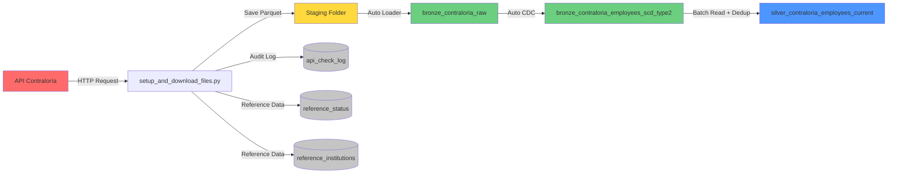

# 🏛️ Pipeline de Nómina - Contraloría General de la República de Panamá

[](https://www.linkedin.com/in/jquesada92/)
[](https://databricks.com)
[](https://www.python.org/)

## 📋 Descripción

Pipeline de datos empresarial para la extracción, procesamiento y análisis de información de nómina de empleados públicos de la República de Panamá, obtenida desde la API oficial de la Contraloría General de la República.

Este proyecto implementa una arquitectura de datos moderna utilizando **Spark Declarative Pipelines (Delta Live Tables)** en **Databricks**, siguiendo el patrón **Medallion Architecture** (Bronze → Silver) con capacidades avanzadas de seguimiento histórico mediante **SCD Type 2**.

---

## 🏗️ Arquitectura del Sistema

### Diagrama de Arquitectura General

```
┌─────────────────────────────────────────────────────────────────────────────┐
│                          ARQUITECTURA MEDALLION                              │
└─────────────────────────────────────────────────────────────────────────────┘

┌──────────────────┐       ┌──────────────────┐       ┌──────────────────┐
│                  │       │                  │       │                  │
│   API Externa    │──────▶│  Staging Layer   │──────▶│   Bronze Layer   │
│   Contraloría    │       │  (Parquet Files) │       │  (Raw Ingestion) │
│                  │       │                  │       │                  │
└──────────────────┘       └──────────────────┘       └────────┬─────────┘
                                                                │
                           ┌────────────────────────────────────┘
                           │
                           ▼
                    ┌─────────────────┐
                    │                 │
                    │  Bronze SCD-2   │◀─── Auto CDC Flow
                    │  (Historical)   │     (Change Tracking)
                    │                 │
                    └────────┬────────┘
                             │
                             ▼
                    ┌─────────────────┐
                    │                 │
                    │  Silver Layer   │◀─── Materialized View
                    │  (Curated Data) │     (Deduplication)
                    │                 │
                    └─────────────────┘
```

### Flujo de Datos Detallado



---

## 📊 Capas de Datos

### 🥉 Bronze Layer (Datos Crudos)

#### `bronze_contraloria_raw`
* **Tipo**: Streaming Table
* **Fuente**: Auto Loader (cloudFiles)
* **Propósito**: Ingesta incremental de archivos Parquet
* **Características**:
  * Procesamiento automático de nuevos archivos
  * Esquema explícito predefinido
  * Sin transformaciones (datos tal cual desde la fuente)

#### `bronze_contraloria_employees_scd_type2`
* **Tipo**: Streaming Table con SCD Type 2
* **Fuente**: `bronze_contraloria_raw` via Auto CDC
* **Propósito**: Historial completo de cambios por empleado
* **Columnas Rastreadas**:
  * 👤 Nombre, apellido
  * 💼 Cargo
  * 💰 Salario, gastos de representación
  * 📅 Estado laboral, fechas

**Visualización de SCD Type 2:**

```
┌────────────────────────────────────────────────────────────────────┐
│                    Registro SCD Type 2 Example                     │
├────────────┬──────────┬─────────┬────────────┬──────────┬─────────┤
│ cedula     │ nombre   │ salario │ __START_AT │ __END_AT │ __ACTION│
├────────────┼──────────┼─────────┼────────────┼──────────┼─────────┤
│ 8-123-4567 │ Juan     │ 1500.00 │ 2025-01-01 │ 2025-06-01│ UPDATE │ ◄── Versión antigua
│ 8-123-4567 │ Juan     │ 1800.00 │ 2025-06-01 │ NULL      │ INSERT │ ◄── Versión actual
└────────────┴──────────┴─────────┴────────────┴──────────┴─────────┘
```

### 🥈 Silver Layer (Datos Limpios y Curados)

#### `silver_contraloria_employees_current`
* **Tipo**: Materialized View
* **Fuente**: `bronze_contraloria_employees_scd_type2` (batch read)
* **Propósito**: Vista consolidada con solo registros vigentes
* **Transformaciones**:
  * ✅ Deduplicación por: `cedula`, `institucion`, `nombre`, `apellido`
  * ✅ Filtro de registros actuales (`__END_AT IS NULL`)
  * ✅ Traducción de columnas español → inglés
  * ✅ Selección de campos más recientes por ventana de tiempo

---

## 📁 Estructura del Proyecto

```
contraloria_panama/
│
├── 📄 README.md                          # Documentación principal (este archivo)
├── 📄 README_ES.md                       # Versión en español
├── 📄 README_EN.md                       # English version
│
├── 📄 requirements.txt                   # Dependencias Python
├── 🚫 .gitignore                         # Exclusiones de Git
│
├── 🐍 setup_and_download_files.py        # Script de extracción API
│   ├── Crea catálogos y esquemas
│   ├── Crea tablas de referencia
│   ├── Descarga datos desde API
│   └── Registra auditoría
│
├── 📂 pipelines/
│   └── 🐍 dlt_pipeline_contraloria.py    # Definición del pipeline DLT
│       ├── Bronze: Auto Loader ingestion
│       ├── Bronze: Auto CDC (SCD Type 2)
│       └── Silver: Materialized View
│
└── 📂 staging/                           # Archivos temporales (no versionados)
    └── 📊 InformeConsultaPlanilla_*.parquet
```

---

## ⚙️ Configuración del Pipeline

| Parámetro | Valor | Descripción |
|-----------|-------|-------------|
| **Nombre** | `dlt_contraloria` | Identificador del pipeline |
| **Catalog** | `contraloria` | Catálogo de Unity Catalog |
| **Schema** | `employee_payroll` | Esquema de destino |
| **Compute** | Serverless | Sin gestión de clusters |
| **Photon** | ✅ Habilitado | Motor de ejecución optimizado |
| **Modo** | Triggered | Ejecución bajo demanda |
| **Pipeline Type** | Workspace | Archivos en workspace |
| **Archivo Principal** | `/pipelines/dlt_pipeline_contraloria.py` | Definición del DAG |

---

## 🚀 Guía de Instalación

### Requisitos Previos

* ✅ Databricks Workspace con Unity Catalog habilitado
* ✅ Permisos para crear catálogos, esquemas y tablas
* ✅ Acceso de lectura/escritura en workspace
* ✅ Credenciales de API (si aplica)

### Paso 1️⃣: Configurar Base de Datos

Ejecuta el script de configuración:

```python
%run ./setup_and_download_files.py
```

**Este script realiza las siguientes acciones:**

1. 🗄️ Crea el catálogo `contraloria`
2. 📂 Crea esquemas `employee_payroll` y `reference_and_audit`
3. 📋 Crea tablas de referencia:
   * `reference_status` - Estados laborales
   * `reference_institutions` - Instituciones públicas
4. 📝 Crea tabla de auditoría: `api_check_log`
5. 🌐 Extrae datos desde la API de la Contraloría
6. 💾 Guarda archivos Parquet en `staging/`

### Paso 2️⃣: Ejecutar el Pipeline

**Opción A - Interfaz Web:**

1. Navega a **Data Engineering** → **Pipelines**
2. Selecciona el pipeline `dlt_contraloria`
3. Haz clic en **▶️ Start** o **🔄 Start with Full Refresh**
4. Monitorea el progreso en la vista de grafos

**Opción B - Código Python:**

```python
# Obtener updates desde el script de extracción
updates = dbutils.jobs.taskValues.get(taskKey="extraction", key="updates")
print(f"Se procesaron {updates} actualizaciones")
```

---

## 📊 Esquema de Datos

### Tabla Principal: `silver_contraloria_employees_current`

**Ruta completa**: `contraloria.employee_payroll.silver_contraloria_employees_current`

| Columna | Tipo | Nulable | Descripción | Ejemplo |
|---------|------|---------|-------------|---------|
| `id_number` | STRING | ❌ | Cédula del empleado | `8-123-4567` |
| `institution` | STRING | ❌ | Institución donde labora | `TRIBUNAL ELECTORAL` |
| `first_name` | STRING | ✅ | Nombre(s) del empleado | `JUAN CARLOS` |
| `last_name` | STRING | ✅ | Apellido(s) del empleado | `RODRIGUEZ PEREZ` |
| `position` | STRING | ✅ | Cargo o posición | `ANALISTA` |
| `salary` | DOUBLE | ✅ | Salario base mensual (USD) | `1500.00` |
| `allowance` | DOUBLE | ✅ | Gastos de representación (USD) | `300.00` |
| `status` | STRING | ✅ | Estado laboral | `PERMANENTE` |
| `start_date` | DATE | ✅ | Fecha de inicio en el cargo | `2020-01-15` |
| `update_date` | TIMESTAMP | ✅ | Última actualización en fuente | `2026-03-29 10:30:00` |
| `query_date` | TIMESTAMP | ✅ | Fecha de consulta/extracción | `2026-03-29 12:00:00` |
| `file` | STRING | ✅ | Nombre del archivo fuente | `InformeConsultaPlanilla_*.parquet` |

### Llaves y Restricciones

**Primary Keys:**
* **Bronze SCD-2**: `(cedula, institucion)`
* **Silver Dedup**: `(cedula, institucion, nombre, apellido)`

**Sequence Column**: `fecha_consulta` (para ordenamiento temporal en CDC)

---

## 🔄 Proceso de Actualización

### Flujo de Trabajo Completo

```
┌─────────────────────────────────────────────────────────────────────┐
│ PASO 1: EXTRACCIÓN                                                  │
├─────────────────────────────────────────────────────────────────────┤
│ 1. Script consulta API de Contraloría                               │
│ 2. Verifica fecha de última actualización en source                 │
│ 3. Descarga solo datos nuevos/modificados                           │
│ 4. Guarda en formato Parquet optimizado                             │
│ 5. Registra metadata en tabla de auditoría                          │
└─────────────────────────────────────────────────────────────────────┘
                             ⬇️
┌─────────────────────────────────────────────────────────────────────┐
│ PASO 2: INGESTA (BRONZE)                                            │
├─────────────────────────────────────────────────────────────────────┤
│ 1. Auto Loader detecta nuevos archivos en staging/                  │
│ 2. Lee solo archivos no procesados previamente                      │
│ 3. Aplica esquema explícito predefinido                             │
│ 4. Escribe a bronze_contraloria_raw (streaming table)               │
└─────────────────────────────────────────────────────────────────────┘
                             ⬇️
┌─────────────────────────────────────────────────────────────────────┐
│ PASO 3: HISTORIZACIÓN (BRONZE SCD-2)                                │
├─────────────────────────────────────────────────────────────────────┤
│ 1. Auto CDC lee stream desde bronze_contraloria_raw                 │
│ 2. Detecta INSERTs, UPDATEs basados en keys                         │
│ 3. Cierra registros antiguos (__END_AT = timestamp)                 │
│ 4. Inserta nuevas versiones (__END_AT = NULL)                       │
│ 5. Agrega columnas __START_AT, __END_AT, __ACTION                   │
└─────────────────────────────────────────────────────────────────────┘
                             ⬇️
┌─────────────────────────────────────────────────────────────────────┐
│ PASO 4: CURACIÓN (SILVER)                                           │
├─────────────────────────────────────────────────────────────────────┤
│ 1. Lee batch desde bronze SCD-2 table                               │
│ 2. Filtra solo registros actuales (__END_AT IS NULL)                │
│ 3. Aplica ventana de deduplicación por keys                         │
│ 4. Selecciona registro más reciente por grupo                       │
│ 5. Traduce columnas español → inglés                                │
│ 6. Materializa vista optimizada                                     │
└─────────────────────────────────────────────────────────────────────┘
```

### Frecuencia Recomendada

| Proceso | Frecuencia Sugerida | Razón |
|---------|---------------------|-------|
| **Extracción API** | Mensual | Fuente se actualiza mensualmente |
| **Pipeline DLT** | Post-extracción | Procesar solo cuando hay datos nuevos |
| **Monitoreo** | Diario | Validar calidad y completitud |

---

## 📈 Consultas de Análisis

### 1️⃣ Empleados por Institución

```sql
SELECT 
  institution,
  COUNT(*) as total_employees,
  SUM(salary) as total_salary_budget,
  SUM(allowance) as total_allowance_budget,
  AVG(salary) as avg_salary,
  MAX(salary) as max_salary
FROM contraloria.employee_payroll.silver_contraloria_employees_current
GROUP BY institution
ORDER BY total_employees DESC;
```

**Resultado esperado:**
```
┌───────────────────────────┬──────────────────┬──────────────────────┐
│ institution               │ total_employees  │ total_salary_budget  │
├───────────────────────────┼──────────────────┼──────────────────────┤
│ TRIBUNAL ELECTORAL        │ 2,450            │ 4,125,000.00         │
│ TRIBUNAL DE CUENTAS       │ 1,890            │ 3,215,500.00         │
│ TRIBUNAL ADMINISTRATIVO   │ 1,234            │ 2,100,300.00         │
└───────────────────────────┴──────────────────┴──────────────────────┘
```

### 2️⃣ Top 100 Salarios Más Altos

```sql
SELECT 
  id_number,
  CONCAT(first_name, ' ', last_name) as full_name,
  institution,
  position,
  salary,
  allowance,
  (salary + allowance) as total_compensation
FROM contraloria.employee_payroll.silver_contraloria_employees_current
ORDER BY total_compensation DESC
LIMIT 100;
```

### 3️⃣ Historial Completo de un Empleado

```sql
SELECT 
  cedula,
  nombre,
  apellido,
  cargo,
  salario,
  estado,
  __START_AT as valid_from,
  COALESCE(__END_AT, CURRENT_TIMESTAMP()) as valid_to,
  __ACTION as change_type
FROM contraloria.employee_payroll.bronze_contraloria_employees_scd_type2
WHERE cedula = '8-123-4567'
ORDER BY __START_AT DESC;
```

### 4️⃣ Distribución por Estado Laboral

```sql
SELECT 
  status,
  COUNT(*) as employee_count,
  ROUND(COUNT(*) * 100.0 / SUM(COUNT(*)) OVER(), 2) as percentage
FROM contraloria.employee_payroll.silver_contraloria_employees_current
GROUP BY status
ORDER BY employee_count DESC;
```

---

## 🛠️ Mantenimiento y Operaciones

### Monitoreo

#### 1. Estado del Pipeline
```python
# Revisar último update
from databricks import pipelines
pipeline_id = "ffbae848-bc88-4c0e-89a3-32768ee1fc79"
# Ver detalles en la UI del pipeline
```

#### 2. Logs de Auditoría API
```sql
SELECT 
  institution_name_spanish,
  status_name_spanish,
  run_status,
  source_update,
  checked_at,
  time as execution_time_seconds
FROM contraloria.reference_and_audit.api_check_log
WHERE checked_at >= CURRENT_DATE() - INTERVAL 7 DAYS
ORDER BY checked_at DESC;
```

### Limpieza de Staging

```python
# Limpiar archivos procesados (opcional)
staging_path = '/Workspace/Users/jaquesada92@outlook.com/contraloria_panama/staging/'

# Listar archivos
files = dbutils.fs.ls(staging_path)
print(f"Total archivos: {len(files)}")

# Eliminar todos los archivos staging (después de confirmar que el pipeline corrió OK)
dbutils.fs.rm(staging_path, recurse=True)
dbutils.fs.mkdirs(staging_path)
```

### Actualización de Esquema

Si la API agrega nuevas columnas:

1. Modificar `schema` en `dlt_pipeline_contraloria.py` (líneas 29-42)
2. Actualizar transformaciones en la capa Silver (líneas 117-130)
3. Ejecutar **Full Refresh** del pipeline

---

## 📝 Dependencias

**Python Libraries** (`requirements.txt`):
* `openpyxl` - Lectura de archivos Excel/XLSX desde la API

**Databricks Runtime**:
* DBR 14.0+ recomendado
* Unity Catalog habilitado
* Serverless pipelines

---

## 🔗 Enlaces y Recursos

* 🏛️ **Pipeline**: [dlt_contraloria](#pipeline-ffbae848-bc88-4c0e-89a3-32768ee1fc79)
* 📊 **Tabla Principal**: [silver_contraloria_employees_current](#table)
* 📚 **Documentación DLT**: [docs.databricks.com/delta-live-tables](https://docs.databricks.com/delta-live-tables/)
* 🌐 **API Contraloría**: [Sitio oficial](https://www.contraloria.gob.pa/)

---

## 👤 Autor

**Jose Quesada**  
📧 Email: jaquesada92@outlook.com  
💼 LinkedIn: [linkedin.com/in/jquesada92](https://www.linkedin.com/in/jquesada92/)

---

## 📄 Licencia

Este proyecto es de uso interno. Todos los derechos reservados.

---

*Última actualización: Marzo 2026*  
*Versión: 1.0*
